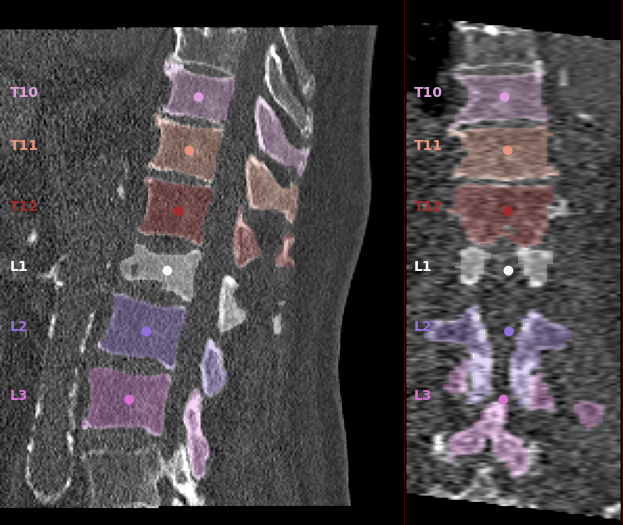

<!--
 * @Description: 
 * @version: 
 * @Author: ThreeStones1029 2320218115@qq.com
 * @Date: 2024-03-26 12:44:24
 * @LastEditors: ShuaiLei
 * @LastEditTime: 2024-04-04 06:51:49
-->
# Deep Learning Spine DRR Toolkit
<h2 align="center">Deep Learning Spine DRR Toolkit</h2>

    

Fig

# 1、Introduction
This repository mainly uses ITK to generate DRR, as well as the corresponding keypoints, detection boxes, and segmentation mask annotations. The generated dataset can be used for pre-trained model training to improve the robustness of deep learning.

# 2、How to Using
## 2.1.Preliminary preparation
### 2.1.1.ITK tool installation
[Official zip download address](https://docs.itk.org/en/latest/download.html)\
windows：You can skip this step without installing ITK.\
linux：Need to compile and install ITK tool, for specific installation can refer to [itkSoftwareGuide.](https://itk.org/ItkSoftwareGuide.pdf)\
[Here is my install process](document/Ubuntu_ITK_install.md).

## 2.2.Dataset preparation
[ct dataset format preparation tutorial](document/Dataset_prepare.md)

## 2.3.Detection(Each vertebra is separated in mask format)
### 2.3.1.Dataset generation
Running the command:
~~~python
python main_drr_detection_dataset.py -c config/detection_config.yml
~~~

### 2.3.2.Parameter Configuration Description(detection_config.yml)
[Detection datasets to generate specific parameter descriptions](document/Detection_parameter_configuration_description.md)

### 2.3.3.Code that is accidentally broken can be regenerated
The generated json file will be automatically saved after each CT generation. Due to accidental termination or active interruption, the generation can continue, and it is necessary to continue to generate and re-run the command
~~~bash
python main_drr_detection_dataset.py -c config/detection_config.yml
~~~
**Note:If you want to regenerate a larger dataset after generating it, you need to delete detection_data.json under data/verse2020_detection_dataset manually. Otherwise, the CT that has been projected in the json file will be automatically detected, starting from the CT that has not been projected.**

### 2.3.4.example

    
    

## 2.4.Detection(verse mask format)
To be updated!

## 2.5.Segmantation(Each vertebra is separated in mask format)
### 2.5.1.Dataset generation
Running the command:
~~~python
python main_drr_segmentation_dataset.py -c config/segmentation_config.yml
~~~
### 2.5.2.Parameter Configuration Description(segmentation_config.yml)
[Segmentation datasets to generate specific parameter descriptions](document/Segmentation_parameter_configuration_desription.md)

### 2.5.3.Code that is accidentally broken can be regenerated
The generated json file will be automatically saved after each CT generation. Due to accidental termination or active interruption, the generation can continue, and it is necessary to continue to generate and re-run the command
~~~bash
python main_drr_segmentation_dataset.py -c config/segmentation_config.yml
~~~
**Note: If you want to regenerate a larger dataset after generating it, you need to delete all json files under data/verse2020_segmentation_dataset manually. Otherwise, the CT that has been projected in the json file will be automatically detected, and the CT that has not been projected will be started from the CT that has not been projected.**

### 2.5.4.example

    
    

## 2.6.Segmantation(verse mask format)
to be updated!

## 2.7.Visualize 3d mask and point in 2d image.
### 2.7.1.run command
~~~bash
python visual_tools/vis_3d_point_and_mask.py
~~~
### 2.7.2.3D points and mask project in 2D image.

## 2.8.3D visualization
To be updated

